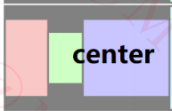
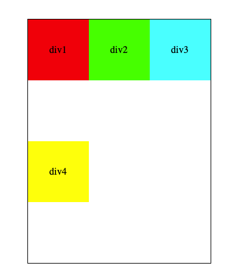

# Flex布局

## Flex布局简介

​		Flex是Flexible的简称，是前端开发中的一种重点布局方式，该布局在在2009年由W3C提出，目前在几乎所有的浏览器中都得到了支持, 相对于传统的盒子模型，他能轻松解决很多复杂的页面布局.

## 如何开启Flex布局

**使用`display`属性可以开启flex布局 该属性有两个取值范围**

1. `display: flex`开启一个行块的flex布局（开启后该元素将独占一行）
2. `display: inline-flex` 开启一个内联flex布局（开启后该元素不独占一行）
3. 开启了flex布局的元素称为flex container 其子元素称为 flex items

> ​	注意：
>
> 1. 如果一个元素开启了flex布局只有其子元素为flex布局 其孙子元素不为flex布局 
>
> 2. 设为 Flex 布局以后，子元素的`float`、`clear`和`vertical-align`属性将失效

```html
<!-- super开启了flex布局 display: flex 该元素叫做flex container 其子元素称为flex items-->
<div class="super">
  	<!--该元素是flex布局-->
    <div class="sub1">
      <!--该元素不是flex布局-->
        <div class="sub2"></div>
    </div>
</div>;
<!-- super和sub1的float、clear和vertical-align属性失效 -->
```

## flex 布局模型

- 默认情况下flex沿着main axis 进行布局 （从main start 到main end）


## 用在flex container上的属性

### 1.  flex-direction  该属性决定了main axis的方向 用来改变flex item的布局方向 取值一共有4个

  - row(默认值) (main start 在左边 main end在右边)

    

  - row-reverse (main start 在右边 main end在左边)

    

  - column (main start在上边 main end 在下边)

    

  - column-reverse (main start 在下边 main end在上边)		

    

### 2.  justify-content 该属性决定了flex items 在main axis上的对齐方式 其取值方式有6个

-  flex-start(默认值) 与main start对齐 没有间距

  

- flex-end 与main end对齐没有间距

  

- center 居中对齐 没有间距

  

- space-between 与main start 与 main end 对齐 flex item 之间的间距相等

  

- space-evenly flex item 之间的间距相等

  

- space-around 各个flex item 之间的间距相等 并且 flex item 与main start 和 main end 之间的间距是 flex item之间间距的一半

  

### 3.  align-items 改属性决定了flex item 在cross axis上的对齐方式 取值方式有5个

- flex-start  与cross satart 对齐

  

- flex-end 与 cross end 对齐

  

- center 居中对齐

  

- baseline 与基准线对齐

  

- stretch(默认值) 当flex items 在cross axis方向上的size为auto时，会自动拉伸至填充 flex container

  

### 4. flex-wrap 决定了 flex container 中的flex items 是单行还是多行显示

- nowrap(默认值) 单行显示

  

- wrap 多行显示

  

- wrap-reverse 多行显示（与wrap对比，cross start 与 cross end相反）

  

### 4. flex-flow 是 flex-direction || flex-wrap的简写属性

> 比如：flex-flow: column wrap 等价于
>
> flex-direction: column
>
> flex-wrap: wrap
>
> 如： flex-flow: row-reverse 等价于
>
> flex-direction: row-reverse
>
> flex-warp: nowrarp

##### 

### 5. align-content 决定了多行flex items 在cross axis 上的对齐方式，用法与justify-content很类似

- stretch（默认值）与align-items的stretch类似

  

- flex-start 与cross start 对齐

  

- flex-end 与 cross end 对齐

  

- center 居中对齐

  

- space-between flex items之间的距离相等

  

- spacer-around flex items之间的距离相等 与 cross start 与cross end 之间的距离是 flex items 之间距离的一半

  

## 用在flex items上的属性

### 1. order 决定了 flex item 的排布顺序 可以设置任意的整数（可以为负值）默认为 0 值越小越排在前面

- div2 的order 为 -1

  

- div2的order 为 1

  

### 2. align-self 可以覆盖掉 flex container 上设置的 align-items 的值 单独给该元素设置对齐方式 取值方式和align-items一样 含义也一样

​	如： `align-self: center` 该元素的对齐方式会覆盖掉 align-items上的对齐方式

### 3.  flex-basis 用来设置flex items 在main cross上的大小

- auto(默认值)
- content 取决于内容本身的size 如果设置的值超过了max-height min-width min-width min-height 会议后者为准

### 4.  flex-grow 可以设置任意非负的数字 包含小数 默认值为0

- 如果flex items在flex container 上的空间有剩余时

  > 1. 如果所有的flex items上的flex-grow的总和值大于1，则每个flex item的扩展size为 flex container的剩余size * flex-grow/所有flex items的总和
  > 2. 如果所有的flex items上的flex-grow的总和值小于1，则每个flex item的扩展size为 flex container的剩余size  * 所有flex items的总和 *  flex-grow
  > 3. flex items 扩展后的最终size 不能超过 max-width/max-height

- 如果flex items在flex container 上的空间没有有剩余时，该属性无效

### 5. flex-shrink 可以设置任意非负的数字 包含小数 默认值为1

- 如果flex items超出了flex container 上的空间该值有效

> 假设flex items在flex container 上超出的空间大小为 sum
>
> 收缩比例 = flex-shrink * flex-item的base size
>
> 1. 如果所有 flex-shrink的值大于1 flex item 的收缩大小为  sum * 收缩比例 / 所有flex items的收缩比例之和
> 2.  如果所有 flex-shrink的值小于1  flex item 的收缩大小为 sum * 收缩比例之和 * 收缩比例  /  所有flex items的收缩比例之和

- 如果flex items没有超出了flex container 上的空间时 该值无效

### 6. flex 是 flex-grow flex-shrink? || flex-basis的简写

- 默认值为 0 1 auto
- none 为 0 0 auto

##### 

##### 


