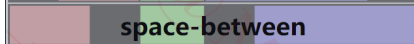

# Flex布局

## Flex布局简介

​		Flex是Flexible的简称，是前端开发中的一种重点布局方式，该布局在在2009年由W3C提出，目前在几乎所有的浏览器中都得到了支持, 相对于传统的盒子模型，他能轻松解决很多复杂的页面布局.

## 如何开启Flex布局

**使用`display`属性可以开启flex布局 该属性有两个取值范围**

1. `display: flex`开启一个行块的flex布局（开启后该元素将独占一行）
2. `display: inline-flex` 开启一个内联flex布局（开启后该元素不独占一行）
3. 开启了flex布局的元素称为flex container 其子元素称为 flex items

> 注意：
>
> 1. 如果一个元素开启了flex布局只有其子元素为flex布局 其孙子元素不为flex布局 
>
> 2. 设为 Flex 布局以后，子元素的`float`、`clear`和`vertical-align`属性将失效

```html
<!-- super开启了flex布局 display: flex 该元素叫做flex container 其子元素称为flex items-->
<div class="super">
  	<!--该元素是flex布局-->
    <div class="sub1">
      <!--该元素不是flex布局-->
        <div class="sub2"></div>
    </div>
</div>;
<!-- super和sub1的float、clear和vertical-align属性失效 -->
```

## flex 布局模型

- 默认情况下flex沿着main axis 进行布局 （从main start 到main end）


## 用在flex container上的属性


##### flex-direction

​	**该属性决定了main axis的方向 用来改变flex item的布局方向 取值一共有4个 ** 

  - row(默认值) (main start 在左边 main end在右边)

    

  - row-reverse (main start 在右边 main end在左边)

    

  - column (main start在上边 main end 在下边)

    

  - column-reverse (main start 在下边 main end在上边)		

    

##### justify-content

​	**该属性决定了flex items 在main axis上的对齐方式 其取值方式有6个**

-  flex-start(默认值) 与main start对齐 没有间距

  

- flex-end 与main end对齐没有间距

  

- center 居中对齐 没有间距

  

- space-between 与main start 与 main end 对齐 flex item 之间的间距相等

  

- space-evenly flex item 之间的间距相等

  

- space-around 各个flex item 之间的间距相等 并且 flex item 与main start 和 main end 之间的间距是 flex item之间间距的一半

  


##### flex-flow

##### flex-wrap

##### 

##### align-items

##### align-content

## 用在flex items上的属性

##### flex

##### flex-grow

##### flex-basis

##### flex-shrink

##### order

##### align-self


