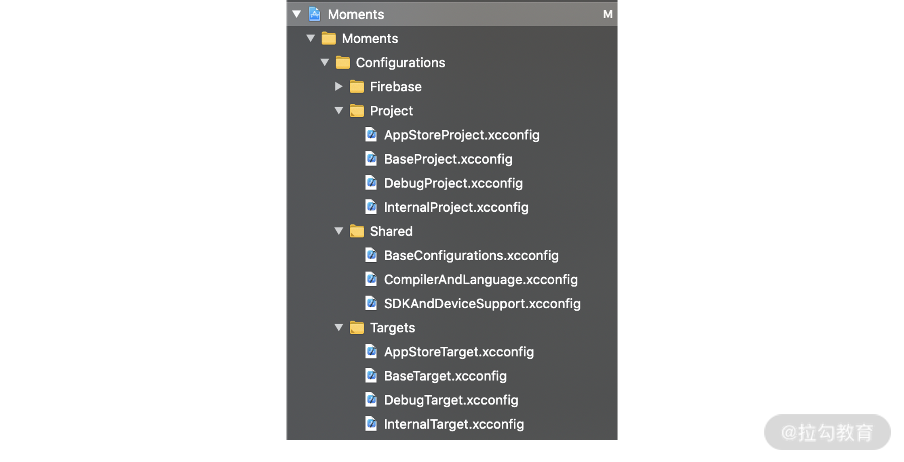

# Xcode 各个文件的作用

## Xcode 构建基础概念

一般在构建一个 iOS App 的时候，需要用到 Xcode Project，Xcode Target，Build Settings，Build Configuration 和 Xcode Scheme 等构建配置。它们各有什么用呢？

## 1. Xcode Project

Xcode Project用于组织源代码文件和资源文件。一个 Project 可以包含多个 Target，例如当我们新建一个 Xcode Project 的时候，它会自动生成 App 的主 Target，Unit Test Target 和 UI Test Targe

## 2. Xcode Target

Xcode Target用来定义如何构建出一个产品（例如 App， Extension 或者 Framework），Target 可以指定需要编译的源代码文件和需要打包的资源文件，以及构建过程中的步骤

有了 Target 的定义，构建系统就可以读取相关的源代码文件进行编译，然后把相关的资源文件进行打包，并严格按照 Target 所指定的设置和步骤执行。那么 Target 所指定的设置哪里来的呢？来自 Build Settings。

## 3. Build Settings

Build Setting保存了构建过程中需要用到的信息，它以一个变量的形式而存在，例如所支持的设备平台，或者支持操作系统的最低版本等

通常，一条 Build Setting 信息由两部分组成：名字和值。比如下面是一条 Setting 信息，iOS Development Target是名字，而iOS 14.0是值

## 4 构建配置

一般用 Xcode 编译出不同环境版本的 App 有多种办法，例如拷贝复制所有源代码，建立多个 Target 来包含不同的源码文件等等。不过，在这里我推荐使用 Build Configuration 和 Xcode Scheme 来管理多环境，进而构建出不同环境版本的 App。为什么？因为这两个是目前管理成本最低的办法。接下来我一一介绍下

## 5. Build Configuration

Build Configuration就是一组 Build Setting。 我们可以通过 Build Configuration 来分组和管理不同组合的 Build Setting 集合，然后传递给 Xcode 构建系统进行编译。 当我们在 Xcode 上新建一个项目的时候，Xcode 会自动生成两个 Configuration：Debug和Release

有了 Build Configuration 以后，我们就能为同一个 Build Setting 设置不同的值。例如Build Active Architecture Only在 Debug configuration 是Yes，而在 Internal 和 AppStore configuration 则是No。这样就能做到同一份源代码通过使用不同的 Build Configuration 来构建出功能不一样的 App 了

## 6. Xcode Scheme

Xcode Scheme用于定义一个完整的构建过程，其包括指定哪些 Target 需要进行构建，构建过程中使用了哪个 Build Configuration ，以及需要执行哪些测试案例等等。在项目新建的时候只有一个 Scheme，但可以为同一个项目建立多个 Scheme。不过这么多 Scheme 中，同一时刻只能有一个 Scheme 生效

当我们选择 Run、Test、Profile、 Analyze 和 Archive 等操作时，在右栏有一个很关键的配置是叫作 Build Configuration，我们可以通过下拉框来选择 Moments App 项目里面三个 Configuration （Debug，Internal 和 AppStore） 中的其中一个

## 7. xcconfig 配置文件

xcconfig也叫作 Build configuration file（构建配置文件），我们可以使用它来为 Project 或 Target 定义一组 Build Setting。由于它是一个纯文本文件，我们可以使用 Xcode 以外的其他文本编辑器来修改，而且可以保存到 Git 进行统一管理。 这样远比我们在 Xcode 的 Build Settings 界面上手工修改要方便很多，而且还不容易出错。

 xcconfig 文件里面的每一条 Setting 都是下面的格式

```
BUILD_SETTING_NAME = value

SWIFT_VERSION = 5.0
```

SWIFT_VERSION是用于定义 Swift 语言版本的 Build Setting，其值是5.0。Setting 的名字都是由大写字母，数值和下划线组成。这种命名法我们一般成为蛇型命名法，例如SNAKE_CASE_NAME。

当我们使用 xcconfig 时，Xcode 构建系统会按照下面的优先级来计算出 Build Setting 的最后生效值：

Platform Defaults (平台默认值)

Xcode Project xcconfig File（Project 级别的 xcconfig 文件）

Xcode Project File Build Settings（Project 级别的手工配置的 Build Setting）

Target xcconfig File （Target 级别的 xcconfig 文件）

Target Build Settings（Target 级别的手工配置的 Build Setting）

Xcode 构建系统会按照上述列表从上而下读取 Build Setting，如果发现同样的 Setting ，就会把下面的 Setting 覆盖掉上面的，越往下优先级别越高

一般后面的会覆盖掉前面的

那么，要怎样做才能做到不覆盖原有的 Build Setting 呢？我们可以使用下面例子中的$(inherited)来实现。

复制代码
BUILD_SETTING_NAME = $(inherited) additional value


可以保留原先的 Setting，然后把新的值添加到后面去。比如：

复制代码
FRAMEWORK_SEARCH_PATHS = $(inherited) ./Moments/Pods

为了重用 我们还可以引入其他配置文件

#include "path/to/OtherFile.xcconfig"

我们把所有 xcconfig 文件分成三大类：Shared、 Project 和 Targets。




其中 Shared 文件夹用于保存分享到整个 App 的 Build Setting，例如 Swift 的版本号、App 所支持的 iOS 版本号等各种共享的基础信息。 下面是 SDKAndDeviceSupport.xcconfig 文件里面所包含的信息：

Project 文件夹用于保存 Xcode Project 级别的 Build Setting，其中 BaseProject.xcconfig 会引入 Shared 文件夹下所有的 xcconfig 配置文件，如下所示

然后我们会根据三个不同的环境分别建了三个xcconfig 配置文件，如下：

- DebugProject.xcconfig 文件

```
#include "BaseProject.xcconfig"
SWIFT_ACTIVE_COMPILATION_CONDITIONS = $(inherited) DEBUG
```

- InternalProject.xcconfig 文件

```
#include "BaseProject.xcconfig"
SWIFT_ACTIVE_COMPILATION_CONDITIONS = $(inherited) INTERNAL
```

- AppStoreProject.xcconfig 文件

```
#include "BaseProject.xcconfig"
SWIFT_ACTIVE_COMPILATION_CONDITIONS = $(inherited) PRODUCTION
```

它们的共同点是都引入了用于共享的 BaseProject.xcconfig 文件，然后分别定义了 Swift 编译条件配置SWIFT_ACTIVE_COMPILATION_CONDITIONS。其中$(inherited)表示继承原有的配置，$(inherited)后面的DEBUG或者INTERNAL表示在原有配置的基础上后面添加了一个新条件。有了这些编译条件，我们就可以在代码中这样使用

```
#if DEBUG
    print("Debug Environment")
#endif
```

该段代码只在开发环境执行，因为只有开发环境的SWIFT_ACTIVE_COMPILATION_CONDITIONS才有DEBUG的定义。这样做能有效分离各个环境，保证同一份代码构建出对应不同环境的 App。

Targets 文件夹用于保存 Xcode Target 级别的 Build Setting，也是由一个 BaseTarget.xcconfig 文件来共享所有 Target 都需要使用的信息。

PRODUCT_BUNDLE_NAME = Moments

这里的PRODUCT_BUNDLE_NAME是 App 的名字。
下面是三个不同环境的 Target xcconfig 文件。

- DebugTarget.xcconfig

```
#include "../Pods/Target Support Files/Pods-Moments/Pods-Moments.debug.xcconfig"
#include "BaseTarget.xcconfig"
PRODUCT_BUNDLE_NAME = $(inherited) α
PRODUCT_BUNDLE_IDENTIFIER = com.ibanimatable.moments.development
```

- InternalTarget.xcconfig

```
#include "../Pods/Target Support Files/Pods-Moments/Pods-Moments.internal.xcconfig"
#include "BaseTarget.xcconfig"
PRODUCT_BUNDLE_NAME = $(inherited) β
PRODUCT_BUNDLE_IDENTIFIER = com.ibanimatable.moments.internal
```

- AppStoreTarget.xcconfig

```
#include "../Pods/Target Support Files/Pods-Moments/Pods-Moments.appstore.xcconfig"
#include "BaseTarget.xcconfig"
PRODUCT_BUNDLE_NAME = $(inherited)
PRODUCT_BUNDLE_IDENTIFIER = com.ibanimatable.moments
```

它们都需要引入 CocoaPods 所生成的 xcconfig 和共享的 BaseTarget.xcconfig 文件，然后根据需要改写 App 的名字。例如DebugTarget 覆盖了PRODUCT_BUNDLE_NAME的值为Moments α*, 其所构建的 App 叫作Moments α。

一般在 App Store 上所有 App 的标识符都必须是唯一的。如果你的项目通过 Configuration 和 Scheme 来生成免费版和收费版的 App，那么，你必须在两个 Configuration 中分别为PRODUCT_BUNDLE_IDENTIFIER配置对应的标识符，例如com.lagou.free和com.lagou.paid。

在 Moments App 中，我们也为各个环境下的 App 使用了不同的标识符，以方便我们通过 CI 自动构建，并分发到内部测试组或者 App Store。同时，这也能为各个环境版本的 App 分离用户行为数据，方便统计分析


一旦有了这些 xcconfig 配置文件，今后我们就可以在 Xcode 的 Project Info 页面里的 Configurations 上引用它们