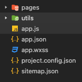

# 微信小程序开发教程-基础简单介绍

## 微信小程序简介

​	微信小程序（Mini Program）上线于2017年1月，是一种不用进行下载既可以使用的应用（实际上还是需要下载的）

- 优点
  1. 无需下载安装，简单易容，无需卸载，用完即走，内存占用小
  2. 跨平台， 开发简单，发布上线容易（提交到微信公众平台进行审核）
- 缺点
  1. 其用户体验比纯H5的体验要好，但是比起纯原生的还差一些
  2. 对安装包有大小限制，不适宜开发大型app
  3. 其功能 组件都不如原生app丰富

## 微信小程序的使用场景

​	介于微信小程序的一些特点，微信小程序特别适合做一些用户停留时长不长的一些工具型应用，如外卖，购物，车票等，如果个人或者初创型公司有些简单的想法也特别适合先做小程序，因为小程序开发，维护成本较低。先开发小程序等用户量逐渐变大后，在做原生的app。并且小程序自身就提供了数据库，云存储，云函数等相关功能，无需在搭建后台框架等，特别适合在前期项目和人员都不足的情况下，实现一些简单的想法

## 开发微信小程序的一些前置条件

​	要开发微信小程序需要一些前端的相关知识，html, CSS, js等，在小程序中有些也用到了ES6 或者ES7的语法对这些知识点也需要有所了解，若是用到了云函数相关的东西还需要一些node相关的知识

## 开发工具

- 可以使用微信官方提供的微信开发者工具
- 或者也可以使用VS Code 

> 使用这个工具需要安装一些插件 Emmet，minapp, 小程序开发助手

## 小程序的运行环境

| 运行环境   | 逻辑层         | 渲染层            |
| ---------- | -------------- | ----------------- |
| iOS        | JavaScriptCore | WKWebView         |
| Andriod    | V8             | chromiunm定制内核 |
| 开发者工具 | NWJS           | Chrome WebView    |

## 小程序开发文档

- 注册指南

  https://developers.weixin.qq.com/miniprogram/introduction/

- 利用邮箱注册小程序

  https://mp.weixin.qq.com/wxopen/waregister?action=step1

- 官方Demo

## 项目目录结构简单介绍

- 使用微信开着工具新建一个项目后大概包含一下文件

 

 1. pages文件夹存放一些业务界面

 2. utils存放一些工具类

 3. *.js文件主要用来处理逻辑交互 类似于前端开发中的js文件

 4. json 页面配置文件

    https://developers.weixin.qq.com/miniprogram/dev/framework/config.html

	5. wxml文件页面元素文件 类似于 前端的html文件

    https://developers.weixin.qq.com/miniprogram/dev/framework/view/wxml/

	6. wxss文件样式文件 类似于前端的css文件

    https://developers.weixin.qq.com/miniprogram/dev/framework/view/wxss.html

	7. wxs文件 小程序的一套脚本语言

    https://developers.weixin.qq.com/miniprogram/dev/framework/view/wxs/

	8. **注意app.js app.json app.wxss是一些全局的文件如果某个页面单独设置了一些样式会覆盖掉这个文件的一些配置**

- 小程序的逻辑层和渲染测分别在两个不同的线程中执行

  https://developers.weixin.qq.com/miniprogram/dev/framework/quickstart/framework.html#渲染层和逻辑层

