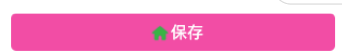

# 微信小程序开发教程-02自定义组件

## 备注

​	小程序开发需要简单的前端知识 就不在一一介绍  一些比简单的知识也不再一一说明 查看官方文档即可

## 组件简介

​	组件其实和一般的页面没什么太大的区别，在日常开放中肯定会遇到有很多相同的元素在不同的界面使用遇到这种情况时我们就可以将其定义为一个一个的组件方便复用

## 组件的创建

​	一般如果这个组件是全局那个页面都有可能会使用，我们会将其定义在最外层新建一个components文件夹，所有全局都有可能会用到的组件放在这个文件夹中，如果这个组件是某个页面中多次使用我们可以将其放在某个页面中的文件夹中, 在微信小程序中右键新建文件夹，然后右键新建Component即可新建一个组件 组件中的文件和一个普通页面一样

## 组件的使用

​	在创建完组件后 如果要使用该组件需要.json文件中进行声明 如果该组件在全局范围内都有可能用到则可以直接写在app.json文件中

1. .json文件做以下配置`"w-header"`为组件的名称 `"/compoents/w-header/w-header"`为组件的路径

```
"usingComponents": {
    "w-header" : "/compoents/w-header/w-header"
  }
```

2. 在wxml文件中直接使用即可

```
<w-header class="top"/>
```

> 注意：在组件上设置class属性中的样式将会失效，解决方案参考后面

## 组件的数据传递

​	比如我们要创建一个 如右图的组件，其中按钮的文字和图标需要从使用组件的地方传递过来

1. 在组件的.js文件中里的properties对象下填写要传递参数的值和类型   icon , text 为传递参数的名称 type为传递参数的类型， value为穿刺参数的值

   ```javascript
   properties: {
       icon: {
         type: String,
         value: ''
       },
   
       text: {
         type: String,
         value: ''
       }
     },
   ```

2. 在wxml文件中直接调用 text属性对应上面的text   icon属性对应上面的eicon

```html
<w-header  text="{{data.text}}" icon="{{data.icon}}"/> <!-- {{}} 这里用到了mustache语法 -->
```


## 组件的事件相应

1. 如果是该组件整体相应事件 则直接在改组件上绑定事件即可
   - wxml文件

```html
<w-header bindtap="saveClick"/>
```

	- js文件

```javascript
saveClick: function () {
    console.log('saveClick');
 }
```

2. 如果是组件中的某个元素需要单独相应事件 

   1. 在组件内部

      - wxml 文件 注意bindtap

      ```html
      <view class="com-button">
        <image bindtap="clickImage" class="icon" src="{{icon}}" mode="heightFix"/>
        <view class="save">{{text}}</view>
      </view>
      ```

      - js文件 在methods方法中注册事件 compImageClick 需要在组件调用者上 增加bidcompImageClick即刻相应单独的image的click事件 {'text': 'Hello Word'} 为组件内部传递的参数

      ```javascript
       methods: {
          clickImage: function () {
            	this.triggerEvent('compImageClick', {'text': 'Hello Word'});
          }
        }
      ```

   2. 组件调用者

      - wxml 文件 注意bindcompImageClick 其中compImageClick要和组件内部的triggerEvent中的方法一致 

      ```html
      <w-header bindcompImageClick="comImageClick" bindtap="saveClick" text="保存" icon="/assets/imgs/ic_tab_home_active.png"/>
      ```

      - .js文件 comImageClick 为 wxml中绑定的 comImageClick

      ```javaScript
      comImageClick: function (param) {
          console.log(param);
      }
      ```

      > 在这里要注意事件的冒泡 详细参考微信官方文档 https://developers.weixin.qq.com/miniprogram/dev/framework/custom-component/events.html

## 组件的样式控制

1. 方法一

   - 给组件传递style值如 组件内部

   ```html
   <view style="background: {{bgColor}}">
     <image bindtap="clickImage" class="icon" src="{{icon}}" mode="heightFix"/>
     <view class="save">{{text}}</view>
   </view>
   ```

   ```javascript
   properties: {
       bgColor: {
         type: String,
         value: '#ff0'
       }
   }
   ```

   调用者 注意bgColor

   ```html
    <w-header bindcompImageClick="comImageClick" class="top"
              text="保存" 
              icon="/assets/imgs/ic_tab_home_active.png"
              bgColor="#f0f"/>
   ```

   

2. 方二 外部样式类 https://developers.weixin.qq.com/miniprogram/dev/framework/custom-component/wxml-wxss.html

- 组件内部js文件新增externalClasses属性

```javascript
Component({
  externalClasses: ['my-class']
})
```

- 组件内部wxml文件

```html
<view class="com-button my-class" style="background: {{bgColor}}">
  <image bindtap="clickImage" class="icon" src="{{icon}}" mode="heightFix"/>
  <view class="save">{{text}}</view>
</view>
```

- 组件调用者 注意  my-class 要和上面的my-class子对对应

```html
<w-header bindcompImageClick="comImageClick"
           text="保存" 
           my-class="bottom"
           icon="/assets/imgs/ic_tab_home_active.png"
           bgColor="#f0f"/>
```

- 组件调用者wxss文件

```CSS
.bottom {
  margin-bottom: 30rpx;
} 
```

> 注意组件存在样式隔离直接在组件上设置class属性会失效 参考官方文档 https://developers.weixin.qq.com/miniprogram/dev/framework/custom-component/wxml-wxss.html

## 组件的<slot> 节点

​	文档地址 https://developers.weixin.qq.com/miniprogram/dev/framework/custom-component/wxml-wxss.html

​    存在这种情况 组件内大部分元素是通用的个别元素需要通过外部传过来 这时可以使用插槽技术 如 

上面图片中右边的房子有可能是个按钮 或者有可能是个图片等

1. 组件内部wxml文件写法

   ```html
   <view class="com-button my-class" style="background: {{bgColor}}">
     <image bindtap="clickImage" class="icon" src="{{icon}}" mode="heightFix"/>
     <view class="save">{{text}}</view>
     <slot></slot>
   </view>
   ```

2. 组件调用者wxml文件写法 下面的image标签将会替换 上面的<slot></slot>

```html
<w-header bindcompImageClick="comImageClick"
           text="保存" 
           my-class="bottom"
           icon="/assets/imgs/ic_tab_home_active.png"
           bgColor="#f0f">
           <image bindtap="clickImage" class="icon" src="/assets/imgs/ic_tab_home_active.png" mode="heightFix"/>          
</w-header>
```

## 组件的声明周期

参考文档 https://developers.weixin.qq.com/miniprogram/dev/framework/custom-component/lifetimes.html

## 组件数据改变的监听、

参考文档 https://developers.weixin.qq.com/miniprogram/dev/framework/custom-component/observer.html

> 组件还有很多其他的用法详细参考官方文档  https://developers.weixin.qq.com/miniprogram/dev/framework/custom-component/

