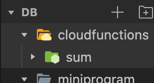

# 微信小程序开发云函数

​	云函数文档 https://developers.weixin.qq.com/miniprogram/dev/wxcloud/guide/functions/getting-started.html

## 新建云函数

在 这个项目中点击鼠标右键新建node.js云函数起一个函数名字 js文件中的的代码 云函数开发完毕需要鼠标右键上传部署一下 参数在event里面

```javascript
// 云函数入口文件
const cloud = require('wx-server-sdk')
cloud.init()

// 云函数入口函数
exports.main = async (event, context) => {
  return 20 + 30;
}
```

## 使用云函数

在小程序项目中的js文件中  callFunction 既是调用云函数 data 是传递的参数

```javascript
callCloudFunction: function() {
    const num1 = 20;
    const num2 = 30;
    wx.cloud.callFunction({
      name: 'sum', // 调用哪个云函数
      data {
      	num1: '10',
      	num2: '20'
    	}
    }).then( res => {
      console.log(res);
    });
  }
```

## 通过云函数获取openid

```javascript
// 云函数入口函数
exports.main = async (event, context) => {
  const wxContext = cloud.getWXContext()
  /// wxContext.OPENID 当前用户在小程序的唯一id
  /// wxContext.APPID 小程序的唯一id
  // wxContext.UNIONID 和公众号绑定 相关 
  return {
    event,
    openid: wxContext.OPENID,
    appid: wxContext.APPID,
    unionid: wxContext.UNIONID,
  }
}
```

## 云函数操作数据库

云函数可以返回一个promise

- 云函数操作数据库权限更大 在删除，修改 可以一次操作多条数据
- 查询的话一次性也可以查询更多的数据
- await

```javascript
exports.main = async (event, context) => {
  const wxContext = cloud.getWXContext()
  /// 获取数据库
  const db = cloud.database();
  const collection = db.collection('students');
  const cmd = db.command;
  return collection.where({

  }).remove().then({

  })
}
```

## 云调用

- 电脑上安装node 可以使用一些  wx-js-utils   axios 第三方库 dependencie需要在这个地方配置依赖库

  ```javascript
  {
    "name": "codeImage",
    "version": "1.0.0",
    "description": "",
    "main": "index.js",
    "scripts": {
      "test": "echo \"Error: no test specified\" && exit 1"
    },
    "author": "",
    "license": "ISC",
    "dependencies": {
      "wx-server-sdk": "~2.4.0" // 配置的依赖ndoe 库
    }
  }
  ```

  

- 获取小程序吗 文档地址 https://developers.weixin.qq.com/miniprogram/dev/api-backend/open-api/qr-code/wxacode.createQRCode.html


