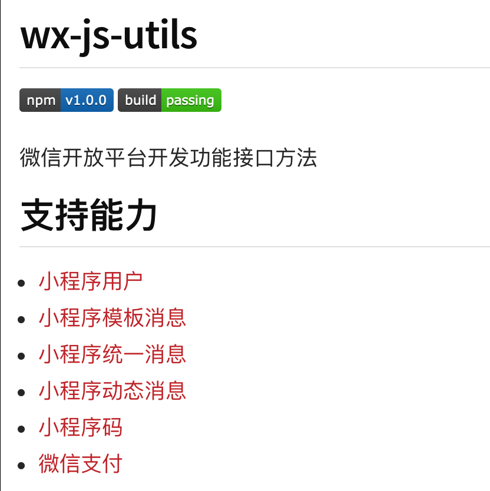

# 微信小程序开发注意事项

- background-image

  该CSS属性不能直接填写本地URL 可以写图片的base64编码 或者一个http url

- setData(Object) 

  文档地址 https://developers.weixin.qq.com/miniprogram/dev/reference/api/Page.html#Page.prototype.setData(Object%20data,%20Function%20callback)

  刷新数据 如果服务端数据返回了 需要刷新页面 调用这个方法

- wx: for 可以写在wxml文件中 用于循环展示一个列表中的数据  文档地址 https://developers.weixin.qq.com/miniprogram/dev/framework/view/wxml/#数据绑定

- 小程序开发组件 库 https://developers.weixin.qq.com/miniprogram/dev/component/

- 网络请求 https://developers.weixin.qq.com/miniprogram/dev/api/network/request/wx.request.html

- 缓存 https://developers.weixin.qq.com/miniprogram/dev/api/storage/wx.setStorageSync.html

- 文件下载 https://developers.weixin.qq.com/miniprogram/dev/api/network/download/wx.downloadFile.html

- 文件上传 https://developers.weixin.qq.com/miniprogram/dev/api/network/upload/wx.uploadFile.html

- Websocket https://developers.weixin.qq.com/miniprogram/dev/api/network/websocket/wx.sendSocketMessage.html

- Udp https://developers.weixin.qq.com/miniprogram/dev/api/network/udp/wx.createUDPSocket.html

- 转发 https://developers.weixin.qq.com/miniprogram/dev/api/share/wx.updateShareMenu.html

- 分享 https://developers.weixin.qq.com/miniprogram/dev/framework/open-ability/share-timeline.html

- 广告 https://developers.weixin.qq.com/miniprogram/dev/framework/open-ability/ad/banner-ad.html

- 直播 https://developers.weixin.qq.com/miniprogram/dev/framework/liveplayer/live-player-plugin.html

- 消息 https://developers.weixin.qq.com/miniprogram/dev/framework/open-ability/subscribe-message.html

- wx:key 传入唯一id 

- 小程序你页面数据传递 可以在页面路径后面增加参数 然后在 下个页面的 生命周期函数中获取

- 小程序 云调用支持网络请求 axios

- wx-js-utils 

  

  